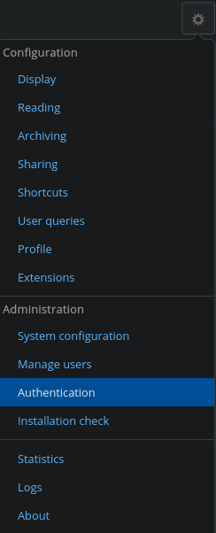
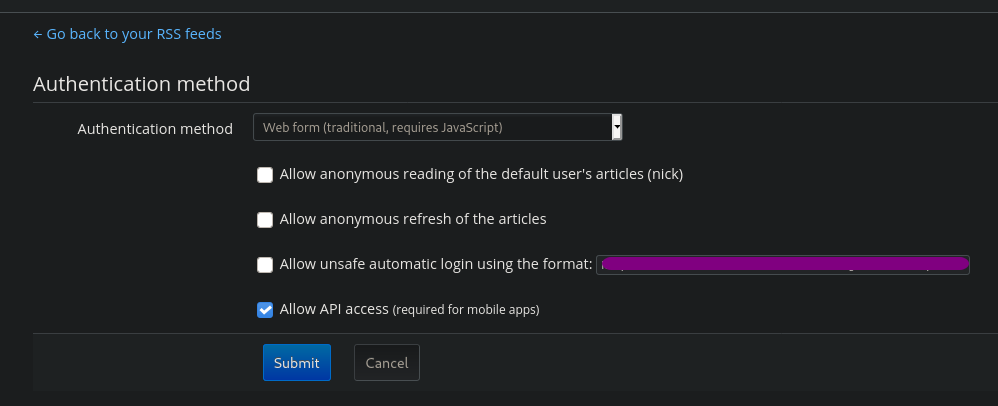
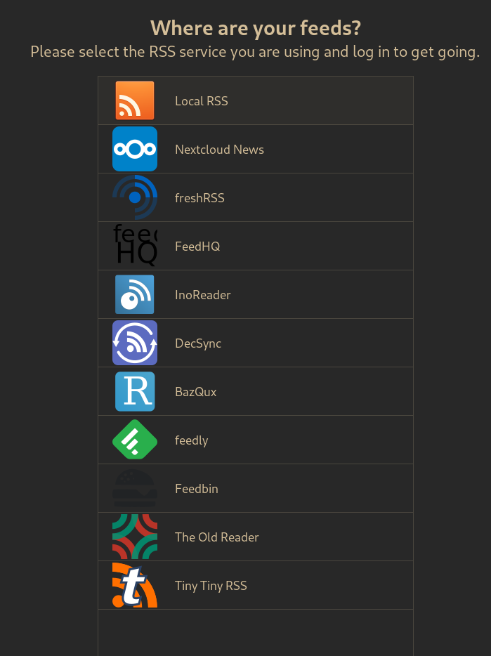
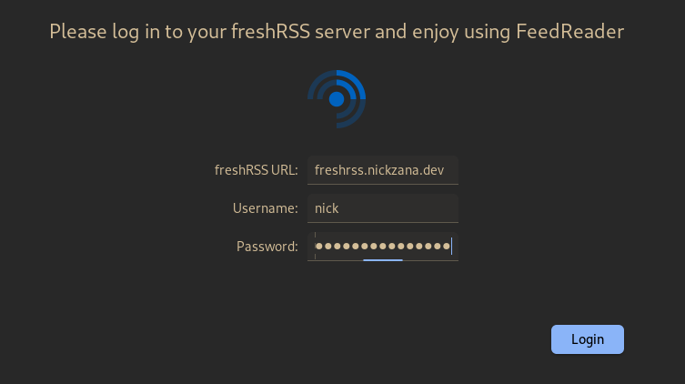
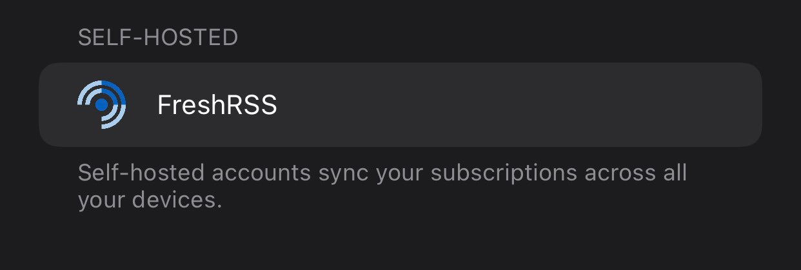
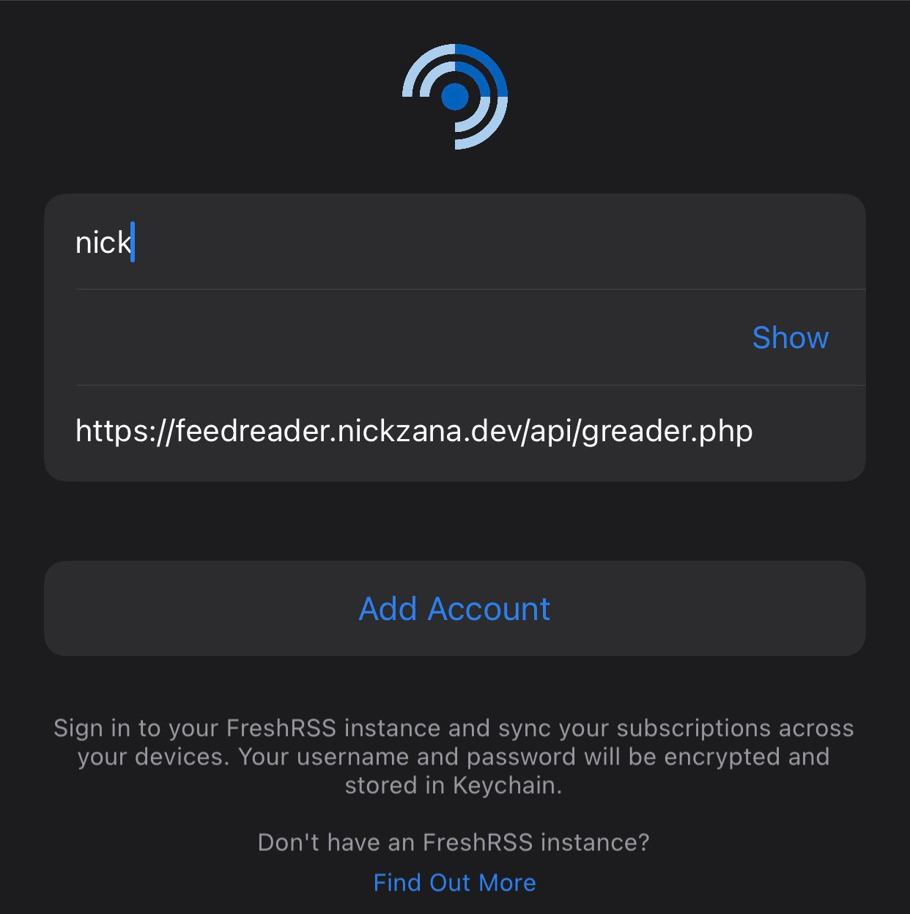

+++
title = "Adding FreshRSS to NetNewsWire"
[taxonomies]
tags = [ "rss", "privacy", "howto" ]
+++

A pain point that I have always had with RSS is syncing my feeds and read
status between devices. There are various solutions out there;
[TinyRSS](http://www.abitrss.com/), [Feedly](https://www.feedly.com/),
[TheOldReader](https://alternativeto.net/software/the-old-reader/about/)...
the [list goes on](https://alternativeto.net/software/google-reader/).

The fact that I couldn't sync my constantly-changing feeds and content read statuses between my devices and [virtual machines](https://www.qubes-os.org/) made me use RSS less and less. It wasn't that RSS was any less useful. It just became too inconvenient compared to directly visiting a small handful of centralized websites like HackerNews, Reddit, and YouTube, directly leading to me losing track of smaller and independent creators. I am slightly ashamed of this; as someone in favor of the open and decentralized web, I gave in to the invasive and harmful platforms.

As of today, that is no more. I have moved back to using RSS, and I am all the more happier for it.

What I really want is a system that works like so:
* A centralized server that manages feeds and read/unread statuses and exposes an API
* A native application to access said API on Linux, iOS, Android, and macOS
* A web application to manage feeds and read articles from anywhere if needed
* Self-hostable and lacks any trackers, analytics, ads, etc.
* Works completely with FLOSS

### My Solution

I came upon this when, earlier today, my [friend](https://ersei.saggis.com) sent me a [link](https://nnw.ranchero.com/2021/04/11/how-to-help.html) to the NetNewsWire TestFlight beta. Why? Turns out, [NetNewsWire 6.0](https://nnw.ranchero.com/2021/03/27/netnewswire-for-mac.html) is adding support for [FreshRSS](https://www.freshrss.org/). As far as I'm aware, this is the first iOS application to support FreshRSS. Several months back, when I attempted to meet the above requirements, I could not get a working docker container to expose an API to clients that supported the second and third requirements. However, upon seeing the above news, I gave FreshRSS another hard look.

An hour of searching and a few config files later, I ended up with the following setup:

* [FreshRSS](https://www.freshrss.org/), a self-hosted FLOSS application that manages feeds and read/unread status running in a [Docker container](https://docs.linuxserver.io/images/docker-freshrss) using `docker-compose`.
* NetNewsWire 6.0 TestFlight Beta on my iOS device acting as a client for FreshRSS
* [FeedReader](https://jangernert.github.io/FeedReader/) on my Desktop

This doesn't seem like much, but it has completely centralized my content consumption. Don't get my wrong, it's not perfect. FeedReader opens links in its native browser instead of my system browser, and I'm yet to find a way to avoid that without simply copying the URLs. FreshRSS is written in PHP, which my strongly-typed Rust-loving self finds unsettling. I must expose my FreshRSS instance to the internet, as, in order to allow clients to access it, I can't put it behind Authelia until I successfully manage to get my own VPN set up in the way I want. However, these are minor issues given that I finally have a centralized location for all of my YouTube, Reddit, Twitter, PeerTube, Mastadon, podcast, and blog content.

### Guide

I ran into a few nags along the way, so here's a guide to how I set it up:

```yaml
---
version: "2.1"
services:
  freshrss:
    image: ghcr.io/linuxserver/freshrss
    container_name: freshrss
    environment:
      - PUID=$PUID
      - PGID=$PGID
      - TZ=$TZ
    volumes:
      - $FreshRSS_NAS:/config
    ports:
      - 8180:80
    restart: unless-stopped

```

After adding on some Traefik labels, I was a simple `docker-compose up -d` away from a full FreshRSS instance.

The setup was mostly simple. The only tricky thing on the server side was ensuring the API was accessible. This can be done by going to the `Authentication` settings, then clicking `Allow API access (required for mobile apps)`, followed by `Submit`.





FeedReader setup was also quite simple. Upon launching the application, I selected "freshRSS" for the location of my feeds:



Entering my `URL`, `username`, and `password` worked exactly as expected.



### NetNewsWire

NetNewsWire, probably due to its current beta status, had a slightly more frustrating onboarding process. By going to `Settings -> Add Account` in the app, FreshRSS was kindly placed in its own self-hosted section.



The `username` and `password` fields worked as expected. However, the `URL` field required the full address (`https://freshrss.nickzana.dev/api/greader.php`).



That's it! While NetNewsWire also has a macOS client, the only platform I haven't tested is Android. However, [this](https://f-droid.org/en/packages/fr.chenry.android.freshrss/) app on F-Droid looks like it would work perfectly.

