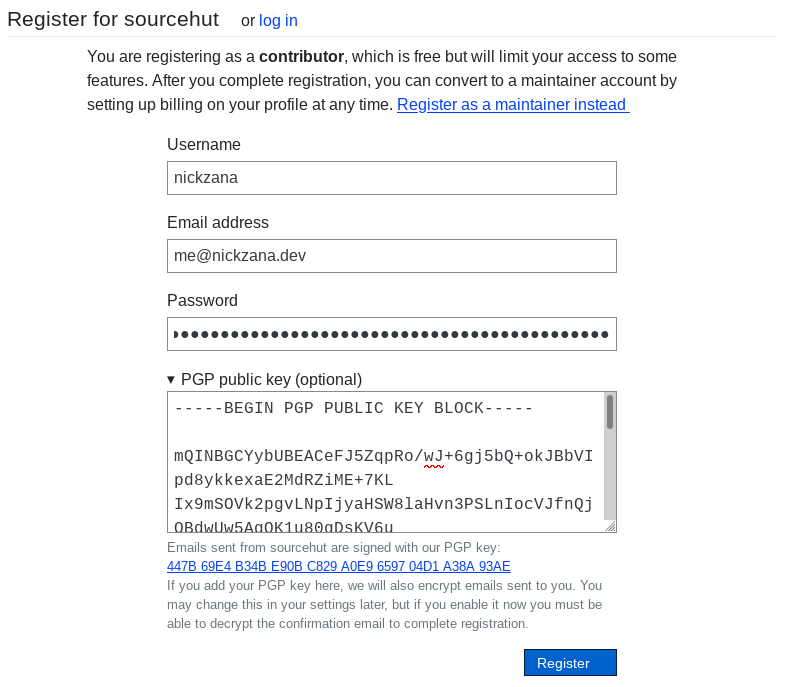
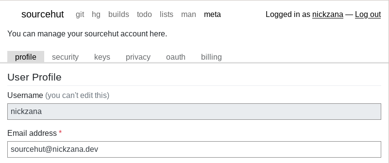
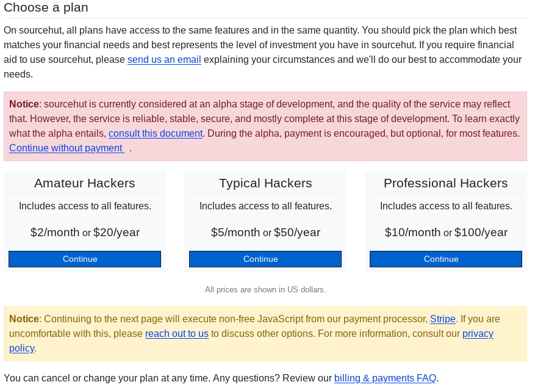
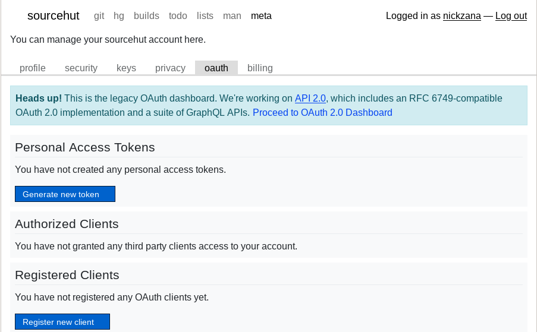
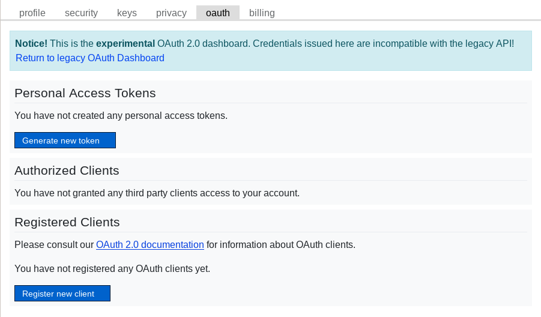
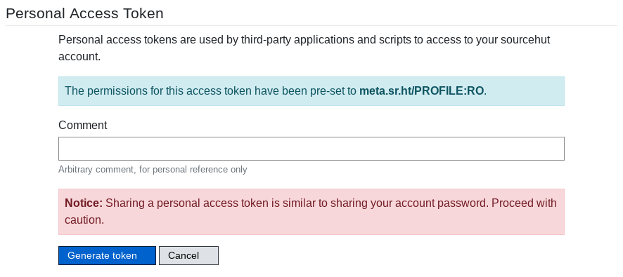

+++
title = "Setting up IRC with soju and senpai"
[taxonomies]
tags = [ "irc","privacy", "howto" ]
+++

Despite the rapid movement of many Free Software project communities to
proprietary platforms like Slack and Discord, many communities continue to live
on IRC. Notably, [The Tor Project](https://www.torproject.org/contact) has
[several channels](https://www.torproject.org/contact/) on
[OFTC](https://www.oftc.net/). While many of these projects also have bridges to
Matrix channels, I don't use Matrix, and there are many communities who continue
to live only on IRC.

Thus, I wanted to set up a simple IRC bouncer and client combination. While I've
used projects like [TheLounge](https://thelounge.chat/) in the past, I wanted an
IRC experience that could exist without a browser.

[SourceHut](https://sr.ht) is a project that I've been interested in for a
while. They provide git hosting like GitHub or GitLab, but avoid locking in
projects and communities with proprietary platform-specific features. They make
heavy use of mailing lists, all of their software is completely Free, and,
perhaps most importantly, the project is refreshingly human. In short, they
value many of the things that make Free Software more than just Open Source.

Projects that are independent, make entirely Free Software, and design systems
to protect user privacy are often difficult to fund, which is why SourceHut is
so exciting to watch. They seem to have a relatively [steady
flow](https://sourcehut.org/blog/2022-01-09-how-does-our-business-work/) of
income, and I'm optimistic that their model will prove itself, paving the way
for more Free Software projects to become sustainable.

While not directly related to git hosting, they also operate an [IRC
bouncer](https://en.wikipedia.org/wiki/BNC_(software)#IRC).  In short, an IRC
bouncer maintains a connection to IRC networks and collects messages for you.
You can then connect to the bouncer to read those messages and send messages in
the channels that you've joined.

This has many benefits over operating a client on your own machine. For me,
however, the two biggest advantages were the ability to register and connect
over the Tor network and financially support SourceHut. Most IRC networks fight
spam by blocking registration over Tor. By contrast, SourceHut is happy to
accept registration without any JavaScript; all it needed was a username, email
address, and password. While the [chat.sr.ht](https://chat.sr.ht) project
requires a paid account, this was a perfectly acceptable compromise for me, as
anonymity was never my goal.

[`soju`](https://soju.im/), a project by SourceHut, is the software underlying
the [chat.sr.ht](https://chat.sr.ht) bouncer. It's written in `Go`, financially
supported by SourceHut, and seems relatively simple to interface with.

Normally, I would self-host a service like this. Actually, for a while, that's
what I did.  What compelled me to try the hosted solution was the inherently
public nature of how I plan to use IRC. I won't be using IRC for one-to-one
communication, or even within small groups. That's what messaging platforms like
Signal are for. I intend to use IRC for interacting with public communities,
where all of my messages can (and should) be readable by everyone.

### SourceHut Account Setup

As mentioned previously, SourceHut's hosted
[https://chat.sr.ht](https://chat.sr.ht) instance of `soju` requires a paid
account. This seems fairly reasonable, especially given the very generous and
flexible [pricing](https://sourcehut.org/pricing/).



Registration is incredibly simple. All I needed to do was provide a username,
email address, and password. They even let me include a PGP key to both encrypt
emails sent from their service and be presented on my profile.

Upgrading to a paid account was just as simple. Heading to my [profile
page](https://meta.sr.ht/profile), I clicked on billing:



The billing page provided clear information on who needed to sign up for a paid
account and transparency into the payment processor. I particularly appreciate
the notice that non-free JavaScript would be required for payment, along with an
invitation to find an alternative for those who wish to avoid using Stripe.



### senpai client setup

For my IRC client, I've chosen to go with
[`senpai`](https://sr.ht/~taiite/senpai/). While there are a [few other
clients](https://git.sr.ht/~emersion/soju/tree/master/item/contrib/clients.md)
listed in the `soju` docs, `senpai` is, like `soju`, written in `Go`, and
explicitly designed to work well with the bouncer. Documentation for connecting
clients, including `senpai`, to `chat.sr.ht` can be found [on the official
quickstart guide](https://man.sr.ht/chat.sr.ht/quickstart.md).

First thing's first, we need to create a Personal Access Token for our chat. A
Personal Access Token gives SourceHut API access to your account for third-party
applications and scripts. This is done very simply in SourceHut by returning to
the profile page and selecting [`oauth`](https://meta.sr.ht/oauth).



Fortunately, `senpai` supports SourceHut's experimental `OAuth 2.0` API.
Proceeding to the [OAuth 2.0 Dashboard](https://meta.sr.ht/oauth2):



We can generate a new token. Thanks to the experimental API, we can limit the
permissions of this token so that it doesn't have access to other SourceHut
services, like git hosting or profile management. As of writing, the permission
that it needs is the `meta.sr.ht/PROFILE:RO` permission. This seems like a
strange permission for access to the `chat.src.ht` service, so I'd venture to
guess that this permission will change as the `chat.src.ht` service improves, or
the `OAuth 2.0` API comes out of beta. I strongly recommend checking the
[official quick start guide](https://man.sr.ht/chat.sr.ht/quickstart.md) to see
if this is still the case. As of writing, the direct link to generate a new
token is
[https://meta.sr.ht/oauth2/personal-token?grants=meta.sr.ht/PROFILE:RO](https://meta.sr.ht/oauth2/personal-token?grants=meta.sr.ht/PROFILE:RO):



Finally, we need to install and configure the `senpai` client. You can install
it from the [official SourceHut repository](https://git.sr.ht/~taiite/senpai).
Your system's software repository may have a pre-existing package for it.
Otherwise, it can be installed relatively simply from source by cloning the
repository and calling `go install ./cmd/senpai`. Make sure that your `$GOBIN`
is in your `$PATH`.

The configuration file for `senpai` is located at
`~/.config/senpai/senpai.scfg`. To use it with `chat.sr.ht`, it should look
something like this:

```
nickname your_irc_nickname
address chat.src.ht
username your_sourcehut_username
password "your_sourcehut_personal_access_token"
```

Note the quotation marks around your password, those are required. More
configuration options and examples can be found on the [`senpai` man
page](https://git.sr.ht/~taiite/senpai/tree/master/item/doc/senpai.5.scd). The
default settings send typing indicators, so I also disabled those with `typings
false`.

You can finally launch `senpai` with the `senpai` command. Type `/HELP` to get
usage instructions for `senpai`, or view [the man
page](https://git.sr.ht/~taiite/senpai/tree/master/item/doc/senpai.1.scd). Below
is an example of adding `irc.libera.chat` as a network. I switch to the
automatically-created `BUFFER 1`, which is an IRC chat with the `chat.src.ht`
`BouncerServ` interface, which allows you to configure your bouncer. This is
essentially an interface to configure your `soju` user.  Details can, of course,
be found by looking at the `soju` [man
page](https://soju.im/doc/soju.1.html#IRC_SERVICE).

```
> /MSG BouncerServ help
> /BUFFER 1
> network create -addr ircs://irc.libera.chat:6697 -name libera -nick your_irc_nickname
BouncerServ	created network "libera"
```

Great! Now, I'll check the status of the network:

```
nickzana	network status
BouncerServ	libera (ircs://irc.libera.chat:6697) [connected as your_irc_nickname]: 0 channels
```

Unfortunately, I haven't figured out how to open a buffer to a network without
quitting and re-launching `senpai`. It seems like some of the bootstrapping is
undocumented without the web UI, or I'm just misunderstanding the `senpai` man
page. Regardless, after relaunching, I can switch to the newly-created `libera`
buffer.

```
/BUFFER 1
```

To secure my nickname, I'll generate a `CertFP` self-signed certificate for the
`libera.chat` network.  Details on CertFP and how to use it can be found on the
[libera.chat guide](https://libera.chat/guides/certfp).

```
/MSG BouncerServ help
/BUFFER 1
```
```
nickzana	certfp generate -key-type ed25519 libera
BouncerServ	certificated generated
BouncerServ	SHA-1 fingerprint: ...
BouncerServ	SHA-256 fingerprint: ...
BouncerServ	SHA-512 fingerprint: ...
```

Then, I'll register my nickname (in the `libera.chat` buffer):

```
/msg NickServ REGISTER your_password your_email@example.com
```

Don't forget to verify your email!

And, per the [libera.chat guide](https://libera.chat/guides/certfp), register my
certificate fingerprint with my account:

```
/msg NickServ CERT ADD
NickServ:	Added fingerprint ... to your fingerprint list.
```

Finally, I'll join a channel in the `libera` buffer:
```
/join #sr.ht
```

This shows up as a new buffer in `senpai`.

## Closing Thoughts

This process ended up being a bit more difficult than I had initially thought it
would be. Most of the issues would've been solved by just using the `chat.sr.ht`
web client. However, `senpai` is [less than two years
old](https://git.sr.ht/~taiite/senpai/commit/881d63465cdb17357438763d4d2996d5f1d92fcd),
so there's plenty of room to improve. Maybe I'll try another client sometime
soon. Overall, though, I'm quite happy with how it turned out!
