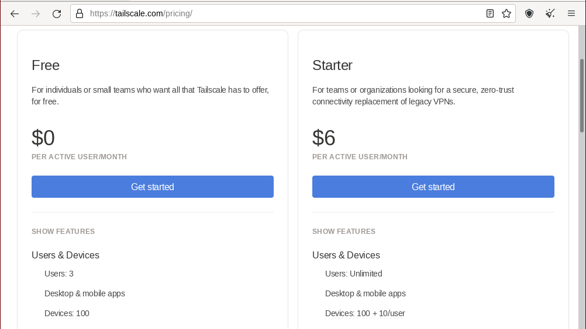
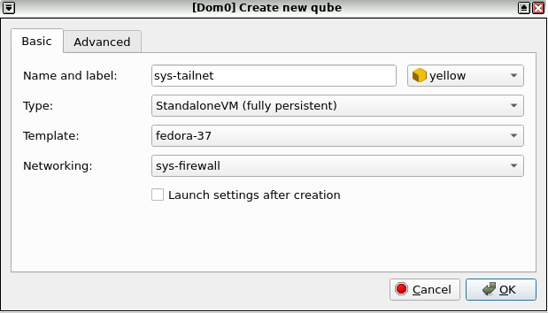
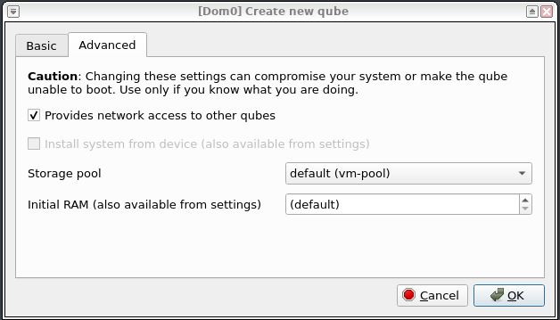

+++
title = "Setting up a Tailscale ProxyVM on QubesOS"
[taxonomies]
tags = [ "qubesos","tailscale", "howto" ]
+++

QubesOS and Tailscale are both useful tools to protect your privacy and
security. However, QubesOS's unique network structure of many VMs being used on
a single host requires additional configuration to be used similarly to
Tailscale.

Once this setup is complete, any AppVM configured to use `sys-tailnet` as its
network qube will have access to your Tailscale network ("tailnet"). All AppVMs
will be able to utilize Tailscale features such as MagicDNS or custom DNS
records to route traffic within your tailnet. The Qubes firewall rules can also
be used to restrict traffic to and from a particular AppVM.

> *Warning*: Tailscale is a unique mesh VPN that doesn't have the same privacy
> and security properties as a typical VPN provider. Ensure you understand how
> Tailscale works before relying on it to protect your QubesOS network traffic.

# Potential Strategies

## A Tailscale AppVM

If you only need to access your tailnet for a particular purpose, it may be
sufficient to simply install Tailscale in the AppVM that needs access it. For
example, if you need to access your job's git server from your `work` AppVM,
just install Tailscale in `work` and you're good to go -- it will only affect
the network traffic from your `work` VM.

Conveniently, this works around one of the most common Tailscale problems: it
allows you to connect to multiple tailnets at once. This is useful if you need
your work AppVM to be connected to your employer's tailnet, but you also want to
access a personal tailnet.

However, if you need to connect several AppVMs, or regularly connect DispVMs, to
your tailnet, a more complex configuration is needed.

## One Node per AppVM

Perhaps the easiest way to configure Tailscale on QubesOS would be to install
the Tailscale daemon (`tailscaled`) in your Template VMs, then register each
AppVM or DispVM based off of those templates as its own node.

The one benefit that this method provides is that you have much greater control
over what each VM can access on your tailnet. For instance, you could log into
different groups of AppVMs with different users, then use Tailscale's Access
Control Lists to limit access to network resources.

However, this method is inconvenient in several ways. For one, Tailscale's
pricing model limits you by the number of devices on your tailnet:



While it would be pretty difficult to use 100 devices, using 100 VMs (especially
if you want to use disposable VMs frequently on within your tailnet) isn't. I'm
not actually sure how deregistering a device works on Tailscale, but it's not
something I would want to think about regularly, especially if I intend to have
multiple QubesOS machines or users on my network.

## `sys-tailnet`

A better way to connect your QubesOS machine to your tailnet is to create a
dedicated network VM, which I call `sys-tailnet`. Following the idioms of
QubesOS, you can register `sys-tailnet` as a network provider for other AppVMs.
While this is certainly the most complicated way to configure Tailscale on your
Qubes machine, it has the benefit of integrating well with the rest of the
QubesOS networking stack, including enforcing per-AppVM firewalls and
controlling which AppVMs route traffic through your tailnet.

An additional benefit of this method is that, as far as Tailscale is concerned,
your QubesOS machine is only a single device, no matter how many VMs you're
running through `sys-tailnet`. This greatly reduces the frequency with which you
have to authenticate (at least compared to the previous method).

# `sys-tailnet` Guide

You can connect `sys-tailnet` to Tailscale like any other Linux system. Once
you're authenticated and connected to your tailnet, configuring `sys-tailnet` is
much like configuring any other ProxyVM in QubesOS.

## Creating `sys-tailnet`

First, create a new AppVM named `sys-tailnet`. For now, the only requirement for
the qube is that you can install `tailscaled`, so it's best to pick a template
that Tailscale has a package repository you can get automatic updates from. See
Tailscale's [Setting up Tailscale on Linux](https://tailscale.com/kb/1031/install-linux/)
guide to check if they publish a repository for your distro.



If you want to avoiding adding Tailscale's package repository to your
TemplateVM, consider making `sys-tailnet` a StandaloneVM or creating a new
TemplateVM for it. You should also select a networking qube to route your
Tailscale traffic through (you likely want this to be `sys-firewall`).



Also, in the "Advanced" tab, mark that `sys-tailnet` provides network access to
other qubes.

## Installing `tailscaled`

Tailscale [provides instructions](https://tailscale.com/kb/1031/install-linux/)
for installing `tailscaled` on a large variety of Linux distros. You'll want to
perform these instructions in `sys-tailnet` if you configured it as a
StandaloneVM, or in your `sys-tailnet`'s TemplateVM if you configured it as an
AppVM. For Fedora, for example, you just install the Tailscale repository:

```bash
sudo dnf config-manager --add-repo https://pkgs.tailscale.com/stable/fedora/tailscale.repo
```

And then use `dnf` to install `tailscaled` like any other package:

```bash
sudo dnf install tailscale
```

## Configuring `sys-tailnet`

### If `sys-tailnet` is a StandaloneVM

If `sys-tailnet` is a StandaloneVM, you can continue to configure it just like
any other Linux system. Enable and start `tailscaled`:
```bash
sudo systemctl enable --now tailscaled
```

Then log into your Tailscale account:

```bash
sudo tailscale up
```

> Tip: see `tailscale up --help` for additional configuration options.

Since Tailscale's session will persist in a StandaloneVM, this is all of the
configuration you need to log into Tailscale.

### If `sys-tailnet` is an AppVM 
In order to start `tailscaled` at launch, you'll need to modify the
`/rw/config/rc.local` script within your `sys-tailnet`. This script is run in
any AppVM whenever it starts. We'll be using it to initialize Tailscale.

Run `sudoedit /rw/config/rc.local` inside `sys-tailnet` and add the following
line to the end of it:

```bash
systemctl --no-block start tailscaled
```

Before we log into Tailscale, however, we need to tell QubesOS to persist the
Tailscale login data on reboot. In general terms, system data usually isn't
persisted between reboots of an AppVM. The `/var/lib/tailscale`directory must be
persisted for Tailscale to remain logged in.

QubesOS provides a mechanism for this called
["bind-dirs"](https://www.qubes-os.org/doc/bind-dirs/). On AppVM boot, it bind
mounts directories in `/rw/bind-dirs`, which is persist across AppVM reboots, to
a corresponding location in the filesystem.

We can persist the Tailscale directory by adding a new configuration file to
`/rw/config/qubes-bind-dirs.d/` in our `sys-tailnet`. If it doesn't exist
already, create the directory by running the following inside `sys-tailnet`:

```bash
sudo mkdir /rw/config/qubes-bind-dirs.d/
```

Then, run `sudoedit /rw/config/qubes-bind-dirs.d/50_user.conf` and add the
following contents to the file:

```conf
binds+=( '/var/lib/tailscale' )
```

Finally, `bind-dirs` won't work correctly if the `/var/lib/tailscale` directory
doesn't exist in the template, so we need to manually create it:

```bash
sudo mkdir -p /rw/bind-dirs/var/lib/tailscale
```

Once you've configured persistence for the `/var/lib/tailscale` directory,
reboot your `sys-tailnet` AppVM. From here, proceed as you normally would to
connect a Linux system to your tailnet:

```bash
sudo tailscale up
```

> Tip: see `tailscale up --help` for additional configuration options.

# DNS

Tailscale relies on DNS for [various
features](https://tailscale.com/kb/1054/dns/). On Linux, Tailscale modifies
`/etc/resolv.conf` to configure the system's DNS resolver. However, these
changes within your `sys-tailnet` do not apply to any AppVMs that use
`sys-tailnet` as their network qube.

In order to forward DNS queries to the Tailscale DNS server, we can forward any
incoming DNS requests in `sys-tailnet` coming from downstream AppVMs to the
Tailscale nameserver. For details on how Tailscale handles DNS traffic, the
article [Private DNS with
MagicDNS](https://tailscale.com/blog/2021-09-private-dns-with-magicdns/) is a
good overview.

In `sys-tailnet`, add the following `iptables` commands to
`/rw/config/qubes-firewall-user-script`:

```bash
#!/bin/sh
# Based on https://forum.qubes-os.org/t/how-do-i-setup-a-custom-dns-in-appvm/5207 

# This will Flush PR-QBS chain
iptables -F PR-QBS -t nat
# Redirects all the DNS traffic to Tailscale DNS server
iptables -t nat -I PR-QBS -i vif+ -p udp --dport 53 -j DNAT --to-destination 100.100.100.100
# Accepts the traffic coming to Tailscale DNS server from XEN's virtual interfaces on port 53
iptables -I INPUT -i vif+ -p udp --dport 53 -d 100.100.100.100 -j ACCEPT
```

> This script will run whenever the AppVM starts, but to avoid restarting
> `sys-tailnet`, you can manually trigger it by running `sudo
> /rw/config/qubes-firewall-user-script`

Tailscale's DNS server runs locally on your device and will forward any DNS
queries that don't belong to your tailnet to the upstream netvm of your
`sys-tailnet` qube, just like any other AppVM.

> Technically, your tailnet administrator can configure DNS settings, but these
> only apply if you include the `--accept-dns` flag in your `tailscale up`
> command.

--- 

That's it! Now you can start configuring your AppVMs access your tailnet while
maintaining the security benefits of QubesOS's compartmentalization.
